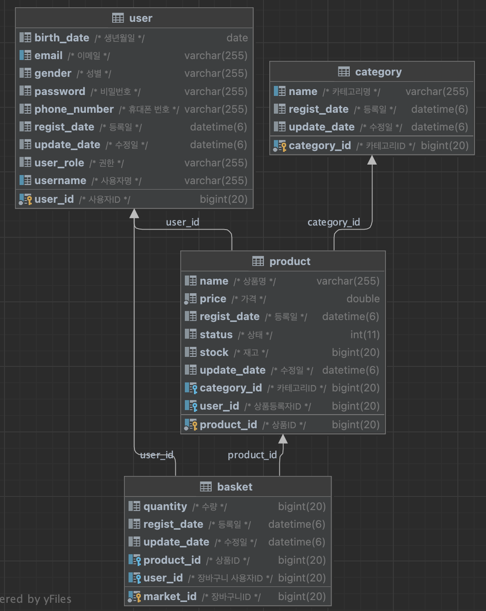

# 🗒 상품 구매 시스템 

## 프로젝트 기능 및 설계
- 회원가입 기능
  - 사용자는 회원가입을 할 수 있다. 일반적으로 모든 사용자는 회원가입시 USER 권한 (일반 권한)을 지닌다. 
  - 회원가입시 아이디와 패스워드를 입력받으며, 아이디는 unique 해야한다. 

- 로그인 기능
  - 사용자는 로그인을 할 수 있다. 로그인시 회원가입때 사용한 아이디와 패스워드가 일치해야한다.

- 카테고리 등록
  - ADMIN 권한을 가진 사용자는 카테고리를 등록할 수 있다.

- 카테고리 수정, 삭제
  - ADMIN 권한을 가진 사용자는 카테고리를 수정, 삭제할 수 있다.
  - 단, 상품이 이미 등록된 카테고리는 삭제 및 수정이 불가능하다.

- 상품 등록
  - ADMIN 권한을 가진 사용자는 상품을 등록할 수 있다.
    
- 상품 수정, 삭제
  - ADMIN 권한을 가진 사용자는 자신이 등록한 상품을 수정, 삭제할 수 있다.

- 상품 리스트 
  - 자신이 저장한 상품을 해당 리스트로 볼 수 있다.
  - 상품들은 최신순으로 기본 정렬되며, 이름순, 가격순으로도 정렬 가능하다.
  - 장바구니에 상품이 많을 수 있으므로 페이징 처리한다.

- 장바구니 저장
  - 권한과 상관없이 상품 담기를 누르면 해당 상품이 장바구니에 저장이 된다.
 
- 장바구니 수정, 삭제
  - 권한과 상관없이 자신의 장바구니 상품을 수정 또는 삭제할 수 있다.

- 장바구니 리스트 
  - 자신이 저장한 상품을 해당 리스트로 볼 수 있다.
  - 상품들은 최신순으로 기본 정렬되며, 이름순, 가격순으로도 정렬 가능하다.
  - 장바구니에 상품이 많을 수 있으므로 페이징 처리한다. 

## ERD 

## Trouble Shooting
[go to the trouble shooting section](docs/TROUBLE_SHOOTING.md)

### Tech Stack

 
   
   
   
  

